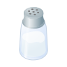

# Rust NACL Wrapper API 
NaCl (pronounced "salt") is a new easy-to-use high-speed software library for network communication, encryption, decryption, signatures, etc. NaCl's goal is to provide all of the core operations needed to build higher-level cryptographic tools.
Of course, other libraries already exist for these core operations. NaCl advances the state of the art by improving security, by improving usability, and by improving speed.

* Migration Status

- [x] Crypto Box 
- [ ] Crypto Secret Box 
- [x] Crypto Hash
- [x] Crypto Sign
- [ ] Documentation
- [x] Tests

* Test
```
$ cargo test
```

* Hashing
``` rust
    let message = "The quick brown fox jumps over the lazy dog";
    let hash_512 = crypto_hash_sha512(message.as_bytes().to_vec()).unwrap();
    assert_eq!(CRYPTO_HASH_SHA512_BYTES, hash_512.len());
```

* Assymetric Cryptography (Box)
```rust
    // Alice and Bob exchanges their public keys
    let (alice_pk, alice_sk) = crypto_box_keypair().unwrap();
    let (bob_pk, bob_sk) = crypto_box_keypair().unwrap();

    let message = "The quick brown fox jumps over the lazy dog";
    let nonce = vec![0u8; CRYPTO_BOX_CURVE_25519XSALSA20POLY1305_NONCEBYTES];
    let nonce_to_open = nonce.clone();
    // Alice encrypts and authenticates a message with her secret key and Bobs public key
    let crypto_text = crypto_box(message, nonce, bob_pk, alice_sk).unwrap();

    // Bob decrypts and validates Alices message with his secret key and Alices public key
    let decrypted_message =
        crypto_box_open(crypto_text, nonce_to_open, alice_pk, bob_sk).unwrap();
    assert_eq!(
        message,
        std::str::from_utf8(
            &decrypted_message[CRYPTO_BOX_CURVE_25519XSALSA20POLY1305_ZEROBYTES..]
        )
        .unwrap()
    );
```

* Sign
``` rust
    let (pk, sk) = crypto_sign_keypair().unwrap();
    let message = "The quick brownfox jumps over the lazy dog";
    let signed_message = crypto_sign(message.as_bytes().to_vec(), sk).unwrap();
    let validated_message = crypto_sign_open(signed_message, pk).unwrap();
    let validated_message = std::str::from_utf8(&validated_message)
        .unwrap()
        .trim_matches(char::from(0));
    assert_eq!(message, validated_message);
```

# References

https://nacl.cr.yp.to/

[PDF](https://cr.yp.to/highspeed/coolnacl-20120725.pdf) - Daniel J. Bernstein, Tanja Lange, Peter Schwabe, "The security impact of a new cryptographic library"
